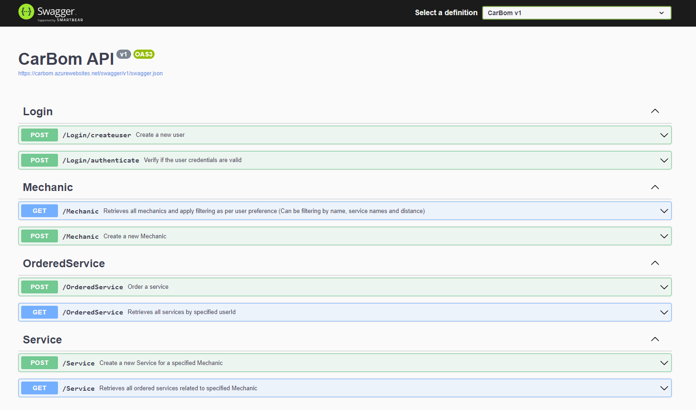
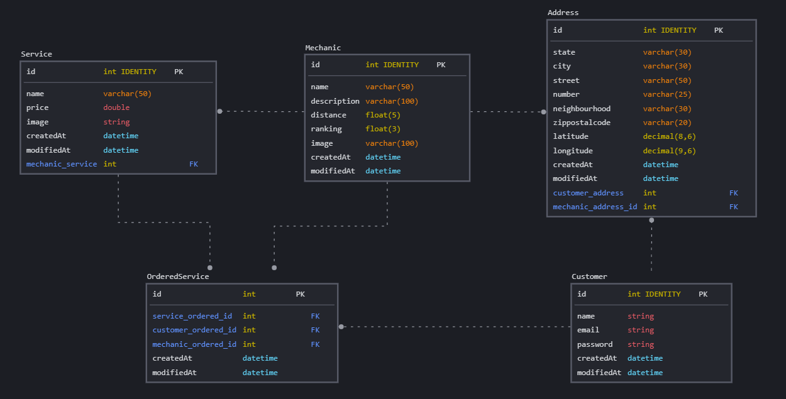

<h1> CarBom 🚗 </h1>
API Rest desenvolvida para o CarBom, um aplicativo que ajuda VOCÊ a encontrar a MELHOR oficina para o seu veículo! 😀

Nele podemos encontrar os seguintes endpoints:

<li>Login</li>
<li>Mechanic</li>
<li>OrderedService</li>
<li>Service</li>

 

</img>

Para verificar a documentação da utilização dessas API'S, <a href="https://carbom.azurewebsites.net/swagger"> ACESSE AQUI O CARBOM! </a>      

Caso queira ter uma cópia em sua máquina, complete o tópico de <a href="#instalacao"> 🔧 Instalação </a>.

<h1> 🚀 Começando </h1>
Essas instruções permitirão que você obtenha uma cópia do projeto na sua máquina local para fins de desenvolvimento e teste.

<h1> 📋 Pré-requisitos </h1>
O que é necessário para a instalação?
 
<pre> <code> 
Visual Studio
SQL Server (ou instância SQL em nuvem)
</code> </pre>

<h1 id="instalacao"> 🔧 Instalação </h1>
Exemplos passo-a-passo que informam o que você deve executar para ter um ambiente de desenvolvimento em execução.

<pre> <code>  
1. Recrie a base de dados SQL em seu desktop. Para o funcionamento do projeto, basta rodar o script <a href="https://github.com/rianers/carbom/blob/main/CarBom/carbom.sql">carbom.sql</a>
 
2. Adicione a string de criação na string <i>CarBom_DB</i> localizada no arquivo <a href="https://github.com/rianers/carbom/blob/main/CarBom/appsettings.json">appsettings.json</a>
 
</code> </pre> 

<h1> ℹ️ Data Model </h1>

</img>

<h1> 🛠️ Construído com </h1>

<b> Tecnologia: </b> <a href="https://learn.microsoft.com/pt-br/dotnet/core/whats-new/dotnet-6"> .NET 6 </a>
 
<b> Fluent Validation - </b> Biblioteca de validação utilizada para criação das regras de negócio.
 
<b> Swagger - </b> Ferramenta para criação da documentação da API.
 
<b> Dapper - </b> Micro ORM utilizado para criação de relação entre o modelo físico e o modelo lógico da aplicação.
 

 by Lift Off 🚀
